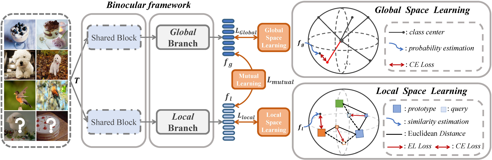

## Binocular Mutual Learning for Improving Few-shot Classification (BML)
[](https://creativecommons.org/licenses/by-nc-sa/4.0/)
[](https://github.com/ZZQzzq/BML/stargazers)
[](./README.md)

## Installation

This repo contains the PyTorch implementation of our ICCV paper "Binocular Mutual Learning for Improving Few-shot Classification". 

BML is a novel and effective solution for few-shot classification. Inspired by the mutual learning paradigm and binocular parallax, we propose this framework, which learn the global relationship between classes and the detailed differences between samples simultaneously. That means, BML has two complementary views, working like human —— they deepen and rectify their perception through two eyes.
<p style="width: 50%; display: block; margin-left: auto; margin-right: auto">
  
</p>

- Full paper PDF: [Binocular Mutual Learning for Improving Few-shot Classification](https://arxiv.org/abs/2108.12104)
- Authors: Ziqi Zhou, Xi Qiu, Jiangtao Xie, Jianan Wu, Chi Zhang.
- Environments: Ubuntu 18.04.5 LTS, Python 3.6. 
- Our weights: [miniImageNet](https://drive.google.com/file/d/1PUJNz8HUSsmX8PkcrnqF2y0PWKkCQuwD/view), [tiredImageNet](https://drive.google.com/file/d/1_ynzWQXdAkgfqzxR620EgnMWa1KWse-H/view), [CUB](https://drive.google.com/file/d/1bz0FW3BCc_JLnLD1mxHK-NS2x5ei2Qbm/view), [CIFAR-FS](https://drive.google.com/file/d/1zz7cvFbtV9GtHkVxpbrMEdpRN8g35ooP/view), [FC100](https://drive.google.com/file/d/134IZc0EfXCIheJBi_BAX_LVTCx8i4HH5/view)

## Setup
### 1. Dependencies
- Linux with Python >= 3.6
- [PyTorch](https://pytorch.org/get-started/locally/) >= 1.6 & torchvision that matches the PyTorch version.
- GCC 7.5
- CUDA 11.2
### 2. Build env
```
virtualenv BML_env --python=python3.6
cd /path/to/venv/BML_env
source ./bin/activate
pip install -r requirements.txt 
```
- Install `Apex` (optional, to enable mixed precision training):

```bash
git clone https://github.com/NVIDIA/apex
cd apex
pip install -v --disable-pip-version-check --no-cache-dir --global-option="--cpp_ext" --global-option="--cuda_ext" ./
```

### 3. Download Data and Weights
- Data Preparation
   - we evaluate BML on five commonly used benchmarks, including miniImageNet, tieredImageNet, CUB, CIFAR-FS and FC100. We collated and summarized the data:
     
     |Dataset|DownloadPath|Split|
     |---|---|---|
     |miniImageNet|[path](https://drive.google.com/file/d/11oy22al0G4Yqg03ugbV_vhcVeG7ATZAR/view)|64/16/20|
     |tieredImageNet|[path](https://pan.baidu.com/s/1e-g8ZDQ61-vzXKM92MzW7Q)(code:123z)|351/97/160|
     |CUB|[path](https://drive.google.com/file/d/1pvVem-KcouXsTrQobQ8dT8GYZ76uYfiX/view)|100/50/50|
     |CIFAR-FS|[path](https://drive.google.com/file/d/1NJmyP3yzL8bOAjn8SiEtbHqa8cT7eEPp/view)|64/16/20|
     |FC100|[path](https://drive.google.com/file/d/1aY-e0J-QjEQnsUaiuRNjpeq6otk5VBNu/view)|60/20/20|
   - unzip dataset to ```/data/few-shot/data/```
- pretraind weights for evaluation
   - we offer our released weights on five benchmarks:
   
     |Dataset|GoogleDriver|BaiDuYun|5way-5shot|5way-1shot|
     |---|---|---|---|---|
     |miniImageNet|[path](https://drive.google.com/file/d/1PUJNz8HUSsmX8PkcrnqF2y0PWKkCQuwD/view?usp=sharing)|[path](https://pan.baidu.com/s/1nertcPLlK2KZ4bqv2CKjmQ)(code:123z)|83.69|67.21|
     |tieredImageNet|[path](https://drive.google.com/file/d/1_ynzWQXdAkgfqzxR620EgnMWa1KWse-H/view?usp=sharing)|[path](https://pan.baidu.com/s/1gICDMc49dAyfrt1iPEqlMw)(code:123z)|85.15|69.49|
     |CIFAR-FS|[path](https://drive.google.com/file/d/1zz7cvFbtV9GtHkVxpbrMEdpRN8g35ooP/view?usp=sharing)|[path](https://pan.baidu.com/s/1Oss_5BFJg9oijJ5tt8xbeA)(code:123z)|88.63|74.99|
     |CUB|[path](https://drive.google.com/file/d/1bz0FW3BCc_JLnLD1mxHK-NS2x5ei2Qbm/view?usp=sharing)|[path](https://pan.baidu.com/s/1-p0OWGgXkT6cNSFK9TcZgA)(code:123z)|89.80|74.42|
     |FC100|[path](https://drive.google.com/file/d/134IZc0EfXCIheJBi_BAX_LVTCx8i4HH5/view?usp=sharing)|[path](https://pan.baidu.com/s/1QVaxLiUBlvFZmAYmcGstSQ)(code:123z)|62.62|44.62|
   - The training and eval details can be found in [log](https://drive.google.com/file/d/1qKBQoIMtV197pEbYnKWG87Pz7HeVT9Yt/view?usp=sharing) and [eval_results](eval_results).
   - download weights to ```pretrained_weights```. 
   - note: We give the latest evaluation results and models which are slightly different from the results reported in the paper. 

## Usage

### 1. training
We give a representative training example on miniImageNet, for other dataset, complete the training by specifying ```--dataset``` and ```--transform```.
```
bash train_bml.sh
```
You need at least one nvidia tesla v100 or two GeForce RTX 2080ti.

If you want to train two baseline models ```baseline-global``` and ```baseline-local```, we also provide corresponding training interfaces:
```
bash train_baseline.sh
```

### 2. evaluation
For fairness, we evaluate BML on 2,000 episodes with 10 random seeds. 
```bash
bash eval_bml.sh miniImageNet A /path/to/weights 5
bash eval_bml.sh miniImageNet A /path/to/weights 1
```

## Acknowlegements
Part of the code refers to [rethinking](https://people.csail.mit.edu/yuewang/projects/rfs/) and [MCT](https://github.com/seongmin-kye/MCT), Please check them for more details and features.

## Citation
When using code within this repository, please refer the following [paper](https://arxiv.org/abs/2108.12104) in your publications:
```
@inproceedings{zhou2021binocular,
  title={Binocular Mutual Learning for Improving Few-shot Classification},
  author={Zhou, Ziqi and Qiu, Xi and Xie, Jiangtao and Wu, Jianan and Zhang, Chi},
  booktitle={Proceedings of the IEEE/CVF International Conference on Computer Vision},
  pages={8402--8411},
  year={2021}
}
```

